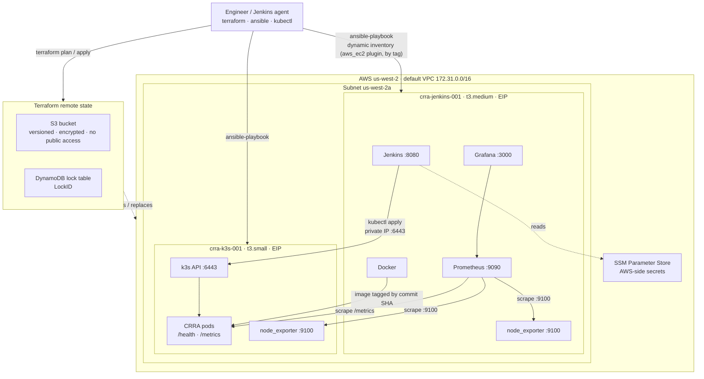

# CRRA Infrastructure Architecture — Target State

This document describes where the CRRA infrastructure is going: from two hand-built EC2 instances to infrastructure that is codified (Terraform), configured by code (Ansible), rebuilt rather than patched, and monitored at both the host and application level.

For the application architecture (scoring strategies, feature toggles) see [architecture.md](architecture.md).

## Diagram

## Layers

**Terraform** owns every AWS resource: VPC and subnet (imported, not recreated), security groups, Elastic IPs, both instances, IAM roles, SSM parameters, and the state backend itself. Code is split into `network`, `compute`, `security` and `monitoring` modules with one root config per environment (`dev`, `staging`), so the same modules produce both environments from different `.tfvars`.

**Remote state** lives in S3 (versioned, encrypted, public access blocked) with a DynamoDB table for locking, so two engineers — or an engineer and the pipeline — cannot corrupt state by applying at the same time.

**Ansible** owns everything inside the instances via roles (`common`, `docker`, `jenkins`, `k3s`, `monitoring`, `hardening`). Inventory is dynamic: the `amazon.aws.aws_ec2` plugin selects hosts by tag, so the Phase 0 failure mode — configuration holding a public IP that changes on restart — cannot recur. Secrets are in Ansible Vault (in-repo) and SSM Parameter Store (AWS-side).

**Immutability.** Instances are not patched in place. Configuration is applied by Ansible, and when the base image or host config changes the instance is replaced with `terraform apply -replace`. Container images are tagged by git commit SHA so a running pod can always be traced to the exact code that built it; `:latest` is not used.

**Monitoring.** Prometheus and Grafana run on the Jenkins host. `node_exporter` on both hosts covers CPU, memory, disk and network. The CRRA Flask app exposes `/metrics` so request rate, latency and error rate are scraped from the application itself, not inferred from the box. One alert rule fires on application error rate.

**Deploy path.** Jenkins builds and tests the app, builds a SHA-tagged image, then runs `kubectl apply` against the k3s API over the instance's **private** IP on 6443. Private IPs are stable across stop/start, which is why this path survived the Phase 0 restart when the public-IP-based configuration did not.

## Design decisions

| Decision | Alternative considered | Why this |
|---|---|---|
| Import the existing VPC/subnet/instances rather than recreate | Destroy and rebuild from scratch | Keeps the working Jenkins and k3s state; import blocks give a reviewable plan proving the code matches reality before anything changes |
| Elastic IPs on both instances | Fix the Jenkins URL by hand after each restart | Removes the root cause of the Phase 0 incident instead of the symptom |
| Dynamic inventory by tag | Static `hosts.ini` | Static inventory holds IPs; IPs are exactly what changed |
| Prometheus on the Jenkins host | Separate monitoring instance | Two instances is the budget; Jenkins host is the larger one |
| SHA-tagged images | `:latest` | `:latest` made rollback and "what is actually running" unanswerable |
